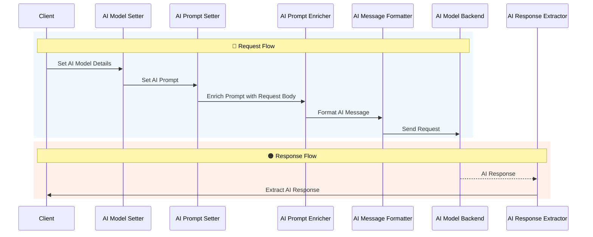

# AI Mediation Interceptors

This folder contains a set of JavaScript interceptors designed to facilitate AI integration in API requests and responses. Below is the documentation for each interceptor and its usage.

## AI Prompt Setter

**Purpose**: Sets the `prompt` value in the `_state` context variable.

**Usage**:
1. Call the `setAIPrompt` function.
2. The function initializes the `prompt` variable with a predefined value.
3. Updates the `_state` context variable with the new `prompt` value.

**Example**:
```javascript
setAIPrompt();
```

---

## AI Prompt Enricher

**Purpose**: Enriches the `prompt` value in the `_state` context variable by appending the request body content.

**Usage**:
1. Call the `enrichPromptWithRequestBody` function.
2. The function retrieves the `_state` context variable and the request body.
3. Appends the request body content to the existing `prompt` value in `_state`.

**Example**:
```javascript
enrichPromptWithRequestBody();
```

---

## AI Model Setter

**Purpose**: Sets the AI model details (`id` and `apiKey`) in the `_state` context variable.

**Usage**:
1. Call the `setAIModel` function with the desired `id` and `apiKey` as parameters.
2. The function updates the `_state` context variable with the provided model details.

**Example**:
```javascript
setAIModel("exampleModelId", "exampleApiKey");
```

---

## AI Message Formatter

**Purpose**: Formats a message to be sent to an AI model API.

**Usage**:
1. The script retrieves `state.model` and `state.prompt` from the context variables.
2. Constructs a payload object with the model ID, user prompt, and system message.
3. Sets the Authorization header using the model's API key.
4. Converts the payload to JSON and sets it as the request body.

**Example**:
```javascript
// Ensure `state.model` and `state.prompt` are set by previous interceptors.
formatAiMessage(state.model, state.prompt);
```

---

## AI Response Extractor

**Purpose**: Processes the AI response and extracts the relevant message content.

**Usage**:
1. Call the `extractAIResponse` function to process the AI response.
2. The function checks the HTTP status of the response.
3. If the status is successful (2xx), it parses the response body and extracts the AI message.
4. If a valid message is found, it creates a new response with the extracted content.

**Example**:
```javascript
extractAIResponse();
```

---

Each interceptor is designed to work in sequence, ensuring smooth integration with the AI model API. Ensure that the `_state` context variable is properly initialized and updated by preceding interceptors.


## Flow Diagram

Below is a flow diagram illustrating the sequence of operations for the AI Mediation Interceptors:



This flow ensures that each interceptor works in harmony, processing the data step-by-step to integrate seamlessly with the AI model API.
